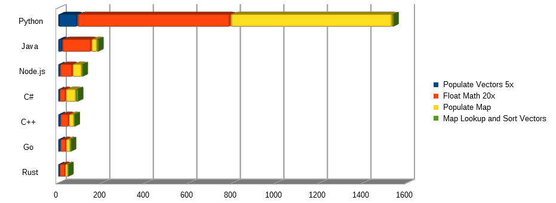

# Performance Test

The purpose of this performance test to to document performance of specific types of statements
most relevant to a server based architecture.

## Notes and Observations

A reasonable attempt was made to have each application behave in a similar manner; however, there
were some issues that arose which resulted in some consessions:

1. the Node.js Map could not be used because it would result in out of memory errors
2. garbage collection was forced, and in the cases where there was no garbage collector, it was simulated by freeing memory manually
3. using const increased performance in some cases
4. there was a noticeable delay between the last log line and the point where the command prompt appeared in some cases
5. all applications ran as 64-bits
6. manually optimizing code with known optimization was deliberately avoided
7. in Java, the random object was created once to make it more similar to other languages

## Execution Times

```powershell
PS C:\Users\User\Documents\code\speed\rust> cargo build --release
   Compiling getrandom v0.1.14
   Compiling cfg-if v0.1.10
   Compiling ppv-lite86 v0.2.6
   Compiling rand_core v0.5.1
   Compiling c2-chacha v0.2.3
   Compiling rand_chacha v0.2.1
   Compiling rand v0.7.3
   Compiling speed v0.1.0 (C:\Users\User\Documents\code\speed\rust)
warning: value assigned to `bigmap` is never read
  --> src\main.rs:65:2
   |
65 |     bigmap = HashMap::<String, i64>::new();
   |     ^^^^^^
   |
   = note: `#[warn(unused_assignments)]` on by default
   = help: maybe it is overwritten before being read?

warning: value assigned to `map_values` is never read
  --> src\main.rs:68:2
   |
68 |     map_values = Vec::<i64>::new();
   |     ^^^^^^^^^^
   |
   = help: maybe it is overwritten before being read?

warning: value assigned to `vs_keys` is never read
  --> src\main.rs:69:2
   |
69 |     vs_keys = Vec::<String>::new();
   |     ^^^^^^^
   |
   = help: maybe it is overwritten before being read?

    Finished release [optimized] target(s) in 2.75s
PS C:\Users\User\Documents\code\speed\rust> .\target\release\speed.exe
Hello, world!
populate vectors 5x 5.9720972s seconds
float math 20x 31.8805653s seconds
populate map 43.8126332s seconds
map lookup and sort vectors 46.9223804s seconds
PS C:\Users\User\Documents\code\speed\rust> cd ..\go\
PS C:\Users\User\Documents\code\speed\go> go build .\speed.go
PS C:\Users\User\Documents\code\speed\go> .\speed.exe
Hello, world!
populate vectors 5x 9.3470027000 seconds
float math 20x 35.6269931000 seconds
populate map 54.9254120000 seconds
map lookup and sort vectors 59.5709886000 seconds
PS C:\Users\User\Documents\code\speed\go> cd ..\cpp\
PS C:\Users\User\Documents\code\speed\cpp> clang -O3 .\main.cpp -o speed.exe
PS C:\Users\User\Documents\code\speed\cpp> .\speed.exe
Hello, world!
populate vectors 5x 9.24109 seconds
float math 20x 48.6685 seconds
populate map 71.9954 seconds
map lookup and sort vectors 76.5116 seconds
PS C:\Users\User\Documents\code\speed\cpp> cd ..\nodejs\
PS C:\Users\User\Documents\code\speed\nodejs> node .\speed.js
Hello, world!
populate vectors 5x 7.234 seconds
float math 20x 65.406 seconds
populate map 107.923 seconds
map lookup and sort vectors 113.425 seconds
PS C:\Users\User\Documents\code\speed\cpp> cd ..\java\
PS C:\Users\User\Documents\code\speed\java> javac .\speed\Speed.java
PS C:\Users\User\Documents\code\speed\java> java speed.Speed
Hello world!
populate vectors 5x  16.824 seconds
float math 20x 152.517 seconds
populate map 178.268 seconds
map lookup and sort vectors 184.970 seconds
PS C:\Users\User\Documents\code\speed\java> cd ..\python\
PS C:\Users\User\Documents\code\speed\python> python .\speed.py
Hello world!
populate vectors 5x 86.8984260559082 seconds
float math 20x 790.569694519043 seconds
populate map 1535.5920796394348 seconds
map lookup and sort vectors 1541.457656621933 seconds
```

## Overall Time

| Language | Populate Vectors 5x | Float Math 20x | Populate Map | Map Lookup and Sort Vectors |
|----------|---------------------|----------------|--------------|-----------------------------|
| Rust     | 5.972               | 31.88          | 43.812       | 46.922                      |
| Go       | 9.347               | 35.626         | 54.925       | 59.57                       |
| C++      | 9.241               | 48.668         | 71.995       | 76.511                      |
| Node.js  | 7.234               | 65.406         | 107.923      | 113.425                     |
| Java     | 16.824              | 152.517        | 178.268      | 184.97                      |
| Python   | 86.898              | 790.569        | 1535.592     | 1541.457                    |

## Individual Time

| Language | Populate Vectors 5x | Float Math 20x | Populate Map | Map Lookup and Sort Vectors |
|----------|---------------------|----------------|--------------|-----------------------------|
| Rust     | 5.972               | 25.908         | 11.932       | 3.11                        |
| Go       | 9.347               | 26.279         | 19.299       | 4.645                       |
| C++      | 9.241               | 39.427         | 23.327       | 4.515                       |
| Node.js  | 7.234               | 58.172         | 42.517       | 5.502                       |
| Java     | 16.824              | 135.693        | 25.751       | 6.702                       |
| Python   | 86.898              | 703.671        | 745.023      | 5.865                       |

## Performance Graph


